<div align="center">

# Lumora

**Switch on the light. See the difference.**

A trilingual lighting-catalog template where a single switch turns the whole page,
and every lamp in the collection, into warm light.

[](https://astro.build)
[](https://tailwindcss.com)
[](https://www.typescriptlang.org)
[](https://firebase.google.com/products/hosting)


**[Live demo: lumora-lighting-riga.web.app](https://lumora-lighting-riga.web.app)**

<br />

<table>
  <tr>
    <th align="center">Light off</th>
    <th align="center">Light on</th>
  </tr>
  <tr>
    <td>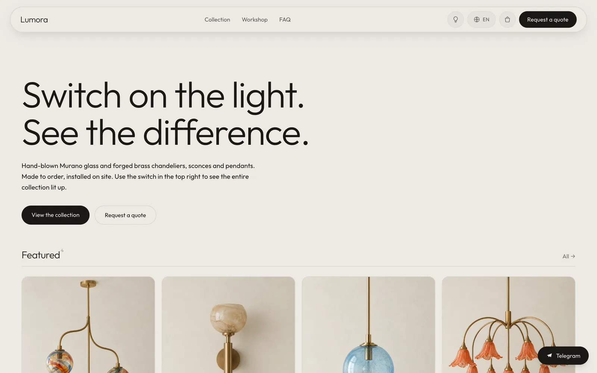</td>
    <td>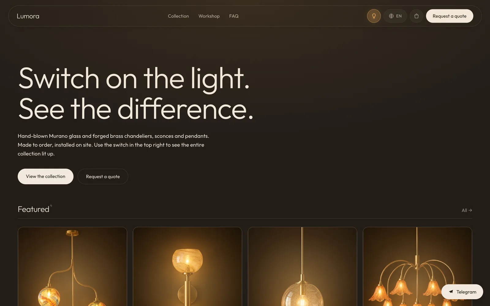</td>
  </tr>
</table>

</div>

---

## The idea

The best sales argument on a lighting website is showing the lamp **lit**.
Lumora turns that into a switch: press the bulb button in the top right and the page
goes dark, a warm ambient glow spreads across the background, and **every lamp in the
catalog lights up at once with a 900 ms crossfade**.

Each product has two photos taken from the same angle (off + on); the transition is
pure CSS. JavaScript only writes the switch state to `<html data-light>`; the choice
is remembered in `localStorage` and applied before first paint (no flash).

**The intro.** A first-time visitor lands on the bright page; about a second after it
loads, the room lights go out on their own and the lamps stay glowing, while the bulb
button pulses twice so people notice the switch. It plays once per session, only for
visitors who haven't picked a side themselves, and is skipped with `prefers-reduced-motion`.
Control it with `defaultLight` in `site.config.ts` (`"intro"` default, `"on"`, `"off"`).

<table>
  <tr>
    <th align="center">Light off</th>
    <th align="center">Light on</th>
  </tr>
  <tr>
    <td>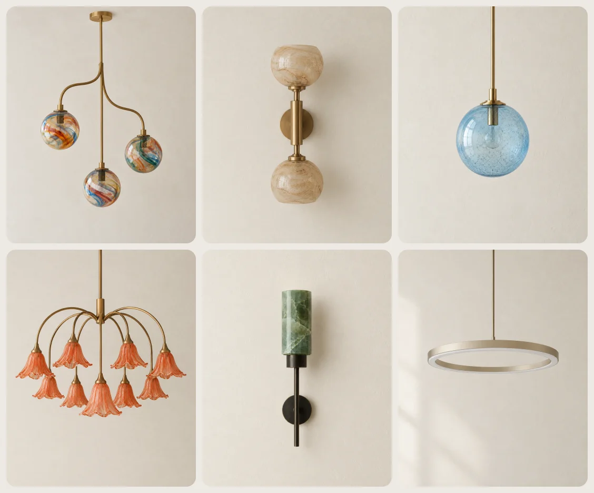</td>
    <td>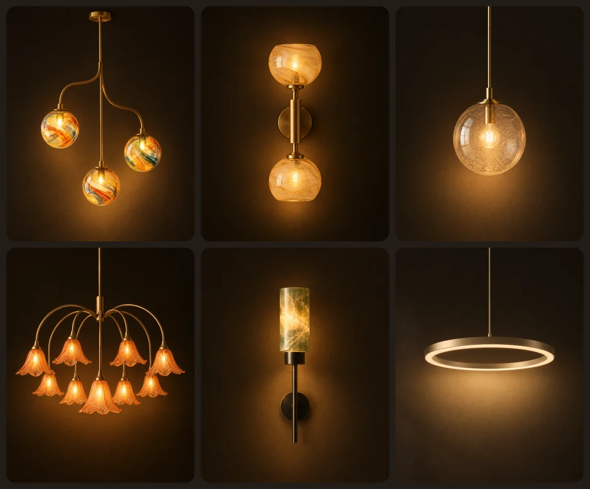</td>
  </tr>
</table>

## Screenshots

### Collection

<table>
  <tr>
    <td>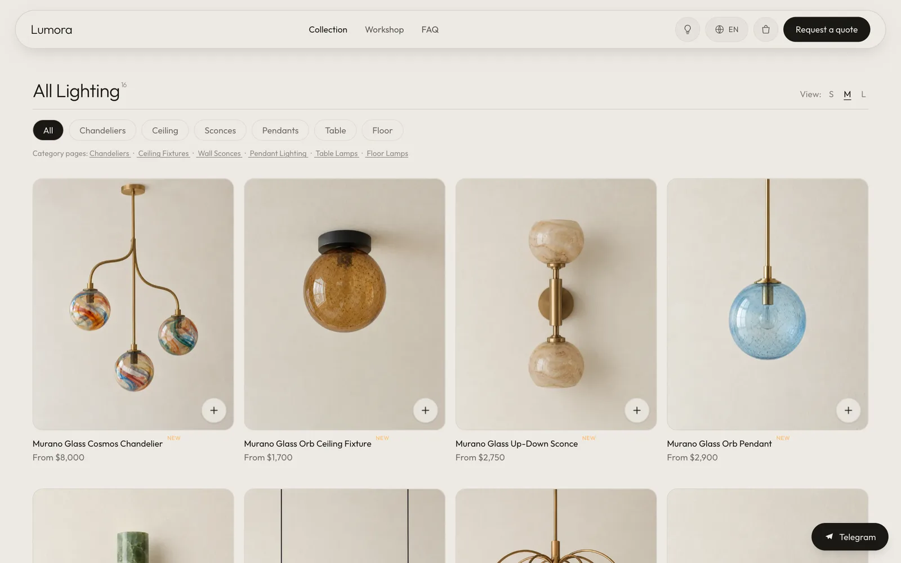</td>
    <td>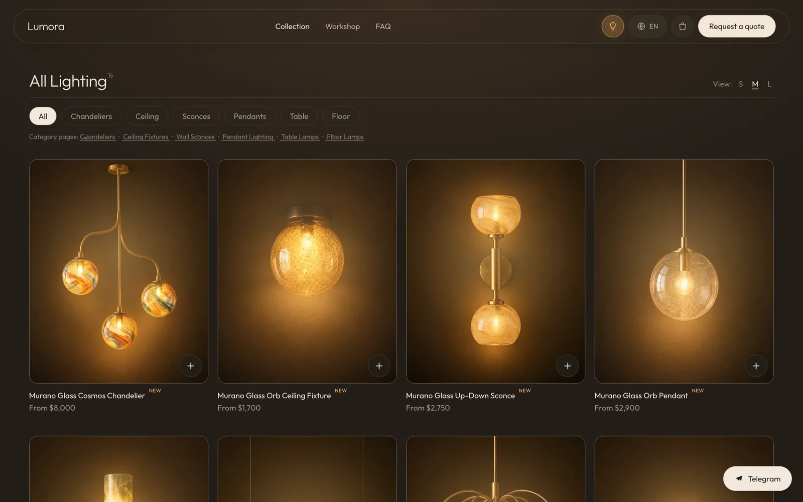</td>
  </tr>
</table>

Category filter, S / M / L view density, and a quick "add to cart" button on every card.
The filter runs on the client, but every product stays in the HTML, so nothing is lost for SEO.

### Product detail

<table>
  <tr>
    <td>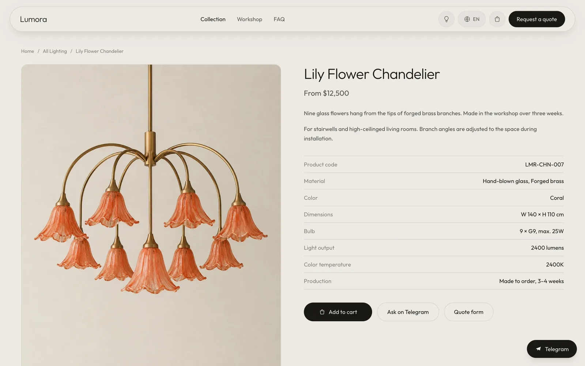</td>
    <td>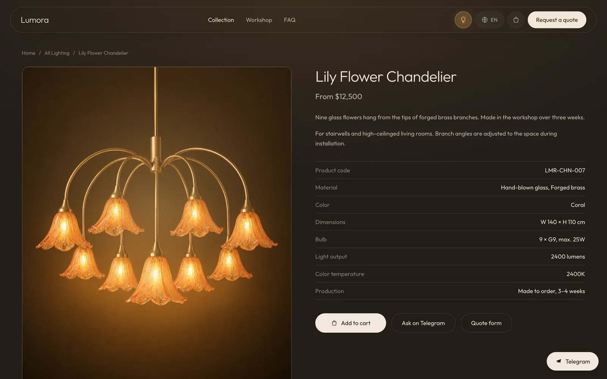</td>
  </tr>
</table>

Spec table (dimensions, bulb, lumens, color temperature), `Product` + `Offer` schema, related products.

### Cart

<table>
  <tr>
    <td>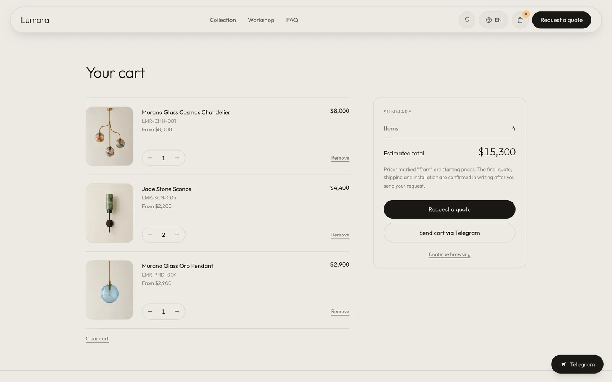</td>
    <td>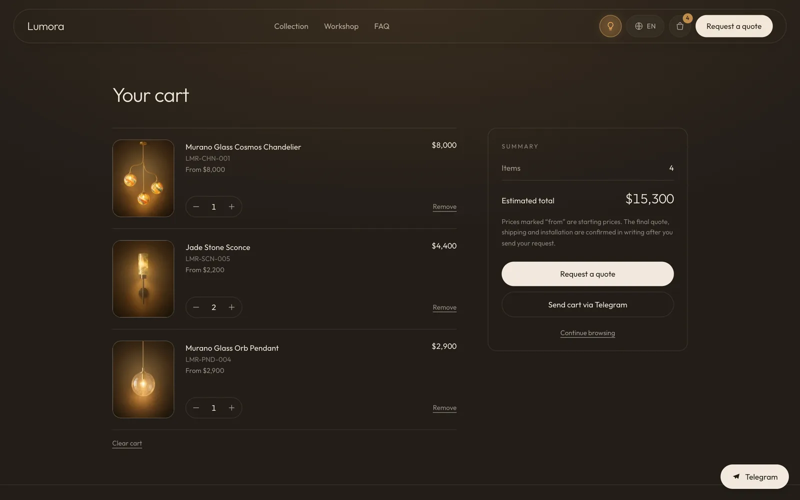</td>
  </tr>
</table>

The cart lives in the browser and there is no checkout: the cart turns into a **quote request**
(it pre-fills the contact form, or carries the summary over to Telegram/WhatsApp).

### Mobile

<div align="center">
  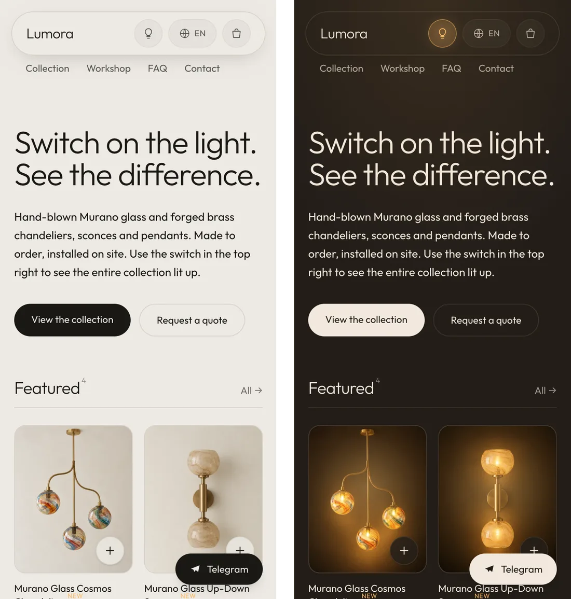
</div>

### Three languages

<table>
  <tr><th align="center">Light off</th></tr>
  <tr><td>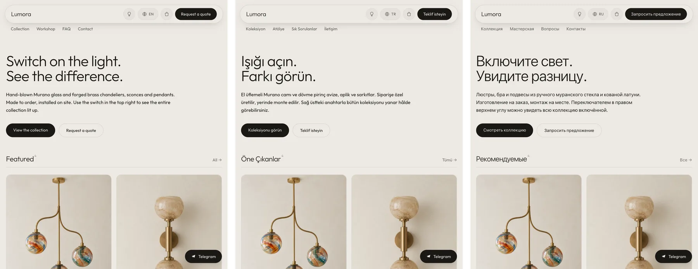</td></tr>
  <tr><th align="center">Light on</th></tr>
  <tr><td>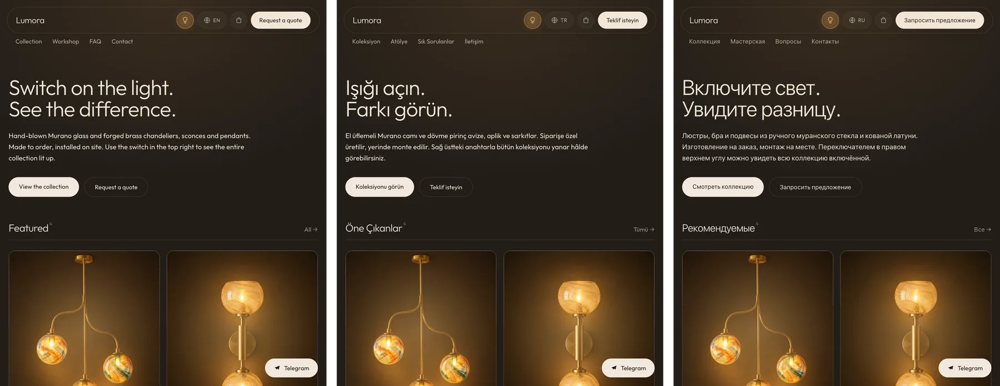</td></tr>
</table>

---

## Features

- **Light switch**: the whole page and catalog change with one switch, the choice is remembered, and first-time visitors get a short "lights go out" intro (`defaultLight`). `prefers-reduced-motion` is respected.
- **Three languages (EN default, TR, RU)**: localized URLs, `hreflang`, and a language menu that always links to the same page in the other language.
- **Floating navbar**: frosted-glass pill with the bulb button, language menu, cart badge and a CTA.
- **Cart**: `localStorage`, quantity controls, estimated total, quote-form / chat hand-off.
- **Quote form**: saved to Firestore plus an email notification, honeypot spam protection.
- **SEO and AI visibility**: JSON-LD (`LightingStore`, `Product`, `FAQPage`, `BreadcrumbList`, `ItemList`), `llms.txt`, a `robots.txt` that welcomes AI bots, sitemap, OpenGraph / Twitter cards.
- **Performance**: images are generated as AVIF/WebP with `srcset` by `astro:assets`, very little JavaScript per page.
- **Accessibility**: skip link, `aria-*`, keyboard-friendly cart, focus management.
- **Template workflow**: a new client only needs three places touched (see below).

## Tech stack

| | |
|---|---|
| Framework | [Astro 5](https://astro.build) (fully static output) |
| Styling | [Tailwind CSS 4](https://tailwindcss.com), light/dark state driven by CSS variables |
| Language | TypeScript (checked with `astro check`) |
| Content | Astro Content Collections (Markdown + Zod schema) |
| Images | `astro:assets` + `sharp` |
| Hosting | Firebase Hosting |
| Form storage | Firestore (REST, no SDK) + FormSubmit.co email |

## Quick start

```bash
npm install
npm run dev       # dev server  → http://localhost:4321
npm run build     # produce dist/
npm run preview   # serve the production build locally
npm run check     # astro check (types + .astro files)
```

Pages: English at the root, Turkish under `/tr/`, Russian under `/ru/`.

## Project structure

```
site.config.ts            business info, currency, Firebase, commerce mode
src/
  assets/products/        32 images: <slug>-off.webp / <slug>-on.webp
  content/products/       16 products (.md), text fields as {en, tr, ru}
  content.config.ts       product schema (the build fails if a field is missing)
  i18n/                   config.ts (languages, URL segments), ui.ts (UI strings)
  layouts/Layout.astro    <html>, SEO, header/footer, cart runtime
  components/             Header, Footer, ProductCard, LightToggle, CartRuntime, Seo, JsonLd
  sections/               the real page content (Home, ProductDetail, Cart, Contact...)
  pages/                  en (root) · tr/ · ru/ · llms.txt · robots.txt · 404
  lib/                    categories, faq, price, schema, images, cartData
  scripts/cart.ts         cart logic (localStorage)
  styles/global.css       theme variables, lamp crossfade
docs/images/              README images
firebase.json             hosting headers, caching, trailingSlash
firestore.rules           form submission rules
```

Each language's page file (`src/pages/tr/...`) is a thin shell that only passes the `lang` prop;
the real content lives in **one place**, `src/sections/`.

---

## Building a site for a new client

Only three places need to be touched:

**1. `site.config.ts`**: business name, address, phone, WhatsApp/Telegram, social links, currency,
Firebase project. Address and phone must match the Google Business Profile **exactly**
(NAP consistency directly affects local ranking). When handing over, set `isDemo: false`:
the demo credit in the footer disappears and the `LocalBusiness` schema starts publishing the real address.

**2. `src/content/products/*.md`**: one file per product. Language-dependent text fields are written as
`{ en, tr, ru }`; language-independent ones (price, SKU, dimensions) stay on a single line:

```yaml
---
title: { en: "Alabaster Disc Pendant", tr: "Alabaster Disk Sarkıt", ru: "Подвес Alabaster Disk" }
sku: "LMR-PND-009"
price: 5400
priceFrom: true
category: "sarkit"
material:
  en: ["Natural alabaster stone", "Brushed brass"]
  tr: ["Doğal alabaster taşı", "Fırçalanmış pirinç"]
  ru: ["Натуральный алебастровый камень", "Матовая латунь"]
dimensions: { w: 60, h: 14 }
lumens: 1800
kelvin: 2700
images:
  off: "alabaster-sarkit-off.webp"
  on: "alabaster-sarkit-on.webp"
  alt: { en: "...", tr: "...", ru: "..." }
description: { en: "...", tr: "...", ru: "..." }
featured: true
order: 9
---
```

**3. `src/assets/products/`**: for every product, a **light-off + light-on** photo pair.

Empty `src/content/products/` and `src/assets/products/`, drop in the new ones, and the site becomes that client's site.

### How to produce the product images

The quality of the crossfade depends on the two frames matching **pixel for pixel**.

1. Generate the **off** frame first (4:5 portrait, 1200 × 1500 px).
2. Do not generate the second frame separately: upload the off image and ask the model to **change only the lighting**. Separate generations drift and the transition flickers.
3. Save as WebP named `<slug>-off` and `<slug>-on`. If a file name is wrong, the build tells you which file is missing.

```bash
cwebp -q 85 image.png -o src/assets/products/cosmos-avize-off.webp   # ~1.7 MB PNG → ~80 KB
```

<details>
<summary>Prompt templates (ChatGPT / Gemini)</summary>

**Step 1: off frame** (replace `[SUBJECT]` with the product)

```text
Professional interior product photograph of [SUBJECT], switched off.

Setting: a plain, softly textured plaster wall in warm off-white (#EDEAE4),
no furniture, no props, no decoration.
Lighting: soft, even, diffused daylight from a large window to the left.
Gentle natural shadow. No lamp light — the fixture is completely unlit.
Camera: straight-on eye-level view, 50mm lens, no perspective distortion,
fixture centred in frame with generous empty wall around it.
Style: calm, editorial, high-end lighting catalogue. Muted natural colour,
true-to-material texture, no colour grading, no vignette.
Vertical 4:5 aspect ratio, 1200x1500px.

Avoid: people, furniture, plants, text, watermark, logo, glowing light,
lens flare, dramatic shadows, wide angle, tilted camera, busy background.
```

Example `[SUBJECT]`: *a handmade chandelier with three hand-blown Murano glass spheres in swirled
multicolour patterns, held at different heights on curved forged-brass arms, 86cm wide*

**Step 2: on frame** (upload the off image, then paste)

```text
Take this exact image and change ONLY the lighting.

Keep identical: camera angle, crop, framing, the fixture's position, size,
shape, material and every proportion. Do not redraw or move the fixture.

Change: the lamp is now switched ON. Bulbs and glass glow warm amber (2700K).
A soft pool of warm light spills onto the wall around and below the fixture.
The rest of the room has gone dark — the wall is now a deep warm brown-black
(#221D18) where the light does not reach. Glass becomes translucent and lit
from within. Metal catches warm highlights on its edges.

Same 4:5 vertical framing, 1200x1500px. Photorealistic, no added objects.
```

</details>

---

## Languages (i18n)

English is the default language and takes no prefix; the other languages get their own prefix and
**the URL words are translated too**. The product slug (`cosmos-avize`) and the category key (`avize`)
are the same in all three languages, so the language menu always lands on the same product/category.

| Page | English | Turkish | Russian |
|---|---|---|---|
| Home | `/` | `/tr/` | `/ru/` |
| Collection | `/products/` | `/tr/urunler/` | `/ru/produkty/` |
| Category | `/products/category/<key>/` | `/tr/urunler/kategori/<key>/` | `/ru/produkty/kategoriya/<key>/` |
| Product | `/products/<product>/` | `/tr/urunler/<product>/` | `/ru/produkty/<product>/` |
| Workshop | `/about/` | `/tr/hakkimizda/` | `/ru/o-nas/` |
| FAQ | `/faq/` | `/tr/sss/` | `/ru/chasto-zadavaemye-voprosy/` |
| Contact | `/contact/` | `/tr/iletisim/` | `/ru/kontakty/` |
| Cart | `/cart/` | `/tr/sepet/` | `/ru/korzina/` |

- **`src/i18n/config.ts`**: language list, default language, URL segments.
- **`src/i18n/ui.ts`**: all UI strings. The `en` block is the reference schema; the `tr` and `ru` blocks are
  checked with `satisfies typeof en`, so **a missing key breaks `npm run check`**.
- **`src/lib/categories.ts`, `src/lib/faq.ts`**: category and FAQ copy, same pattern.

To add a language: add the code and URL segments to `config.ts`, write a new block in `ui.ts` /
`categories.ts` / `faq.ts`, add the language to the `{en,tr,ru}` fields in the product `.md` files,
and create the shell pages under `src/pages/<lang>/` (use `src/pages/tr/` as a template).

## Cart

With `site.config.ts` → `commerceMode: "shop"` you get a "+" button on cards, **Add to cart** on the product page,
a cart icon with a counter in the header, and the cart page. Set it to `"catalog"` and all of it disappears.

- The cart is stored in `localStorage` as `{id, qty}` (`src/scripts/cart.ts`). Title, price and image are resolved
  on every page from that language's catalog (`src/lib/cartData.ts`), so switching language translates the cart too.
- **There is no checkout.** "Request a quote" pre-fills the contact form with the cart contents; "Send cart via Telegram"
  carries the same summary to chat. Most prices are "from" prices, so the cart carries a note saying so.
- After the form is submitted, the cart is emptied on the thank-you page.

## Contact / quote form

A static host has no server, so the form goes from the browser to two places at once:

1. **Firestore** → the `contactRequests` collection (read it in the Firebase console). `firestore.rules` only allows
   *creating* documents with validated fields and lengths; read, update and delete are closed.
2. **Email** → via FormSubmit.co to the address in `site.config.ts → email`. On first use FormSubmit sends that address
   an "Activate Form" email; clicking the link once is enough. Before activation the email channel fails, but the
   Firestore record is still saved.

If either channel succeeds, the visitor is sent to the thank-you page.

## Deploying to Firebase Hosting

```bash
npm run build
firebase deploy --only hosting --project lumora-lighting-riga
# if the rules changed:
firebase deploy --only firestore --project lumora-lighting-riga
```

- Config: `firebase.json` (security headers, immutable caching for `/_astro/*`, `trailingSlash`), `.firebaserc`, `firestore.rules`.
- **For a new client**: create a new Firebase project, update the `firebase` field in `site.config.ts` and `.firebaserc`,
  and connect their domain via Hosting → *Add custom domain*. Then set **`site.config.ts` → `url`** to the real domain;
  the sitemap, canonical URLs and JSON-LD all use it.

## SEO coverage

| | Where |
|---|---|
| `LightingStore` / `LocalBusiness` schema | every page, `src/lib/schema.ts` |
| `Product` + `Offer` (price, stock, size) | product pages |
| `FAQPage` | FAQ page |
| `BreadcrumbList`, `ItemList` | list, category and product pages |
| `hreflang` + `og:locale` | every page's `<head>`, `src/components/Seo.astro` |
| sitemap | automatic, `noindex` pages (cart, thank-you, 404) excluded |
| `robots.txt` | explicit allow for AI bots, `src/pages/robots.txt.ts` |
| **`llms.txt`** | generated from product data, `src/pages/llms.txt.ts` |
| Images | AVIF/WebP + `srcset`, `astro:assets` |

Category pages are the most effective part of the SEO: searches like "chandeliers", "wall sconces" or "kitchen pendant"
land on them rather than on the home page. Each category has its **own** title, description and intro in
`src/lib/categories.ts`; category pages that repeat the same text count as thin content for Google.

**The FAQ has two levels** (`src/lib/faq.ts`): `short` is the one-line summary on the home page, `a` is the full answer on
the FAQ page; the `FAQPage` schema and `llms.txt` use `a`. The schema is only on the FAQ page.

## Currency and price format

```ts
// site.config.ts
currency: "USD",      // used by the JSON-LD Offer and llms.txt
priceLocale: "en-US", // $8,000  (with tr-TR it would be: 8.000,00 $)
```

`price` in the product files is always a **number** (`price: 8000`); `src/lib/price.ts` does the formatting.
The "from" wording is translated per language ("From $8,000", "$8,000'den başlayan", "От $8,000").

## Demo credit

While `isDemo: true`, the footer and the contact page show a "who built this site" block and `llms.txt` gets a note.
In demo mode a fake postal address and coordinates are **not** published; invented business data gets flagged
as spam by Google. Once a real address is entered and `isDemo: false` is set, the `LocalBusiness` schema is
produced in full.

## Font

The UI was designed with **Gilroy**. Gilroy is a commercial font (Fontfabric) and is not included in the repo.
As soon as you drop the licensed `.woff2` files into `public/fonts/` the site switches to Gilroy automatically
(file names are listed in `public/fonts/README.md`). Until then **Outfit** is loaded from Google Fonts; once Gilroy
is in place, delete the Google Fonts lines in `src/layouts/Layout.astro`.

## Roadmap

- Real checkout: replace `src/scripts/cart.ts` and the cart's "Request a quote" button with Stripe/Shopify.
  The product schema (`sku`, `price`, `availability`) was designed to map onto them; swap the `loader` in
  `src/content.config.ts` and the pages stay the same.
- If server-side code is needed (accounts, payment webhooks), add `export const prerender = false` to the relevant
  pages and connect an Astro adapter for Cloud Run / Cloud Functions; catalog pages stay static.
- Firebase App Check if form spam picks up.

---

<div align="center">

Design and development by **Gurbanov Dadebay**, Flutter & Web Developer, Riga, Latvia

[Email](mailto:dadebaygurbanow333@gmail.com) · [Telegram](https://t.me/Gurbanov_D) · [LinkedIn](https://www.linkedin.com/in/gurbanovv) · [GitHub](https://github.com/Dadebay)

</div>
